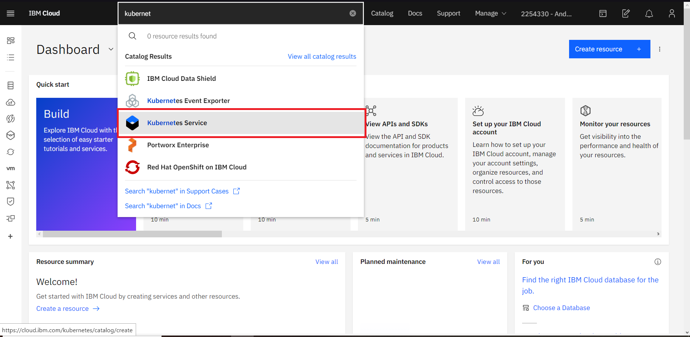
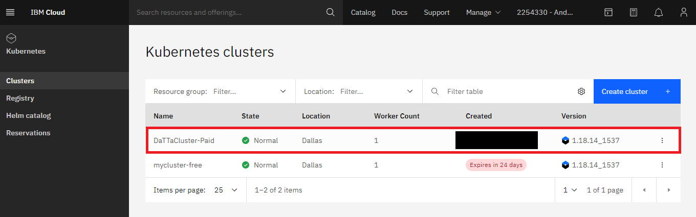
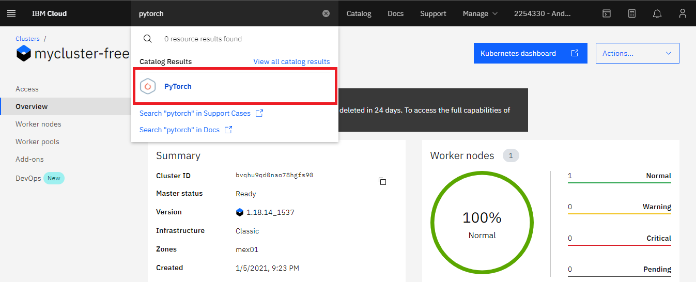
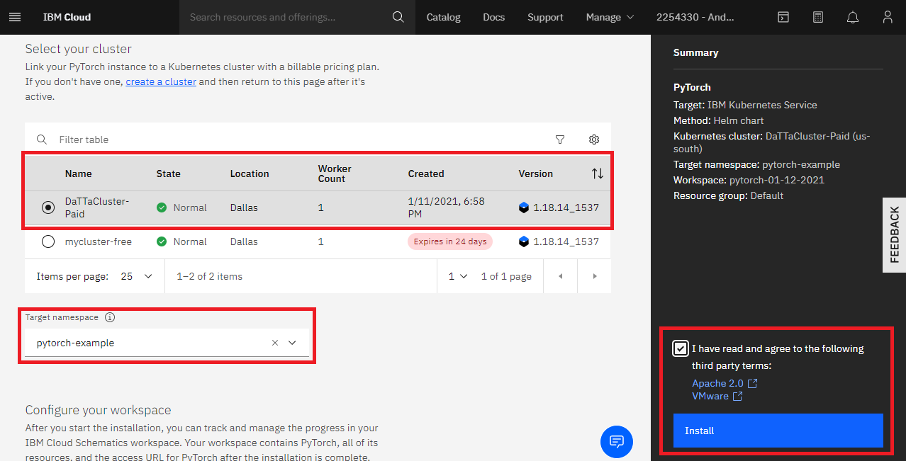
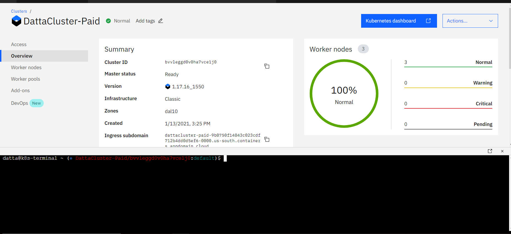
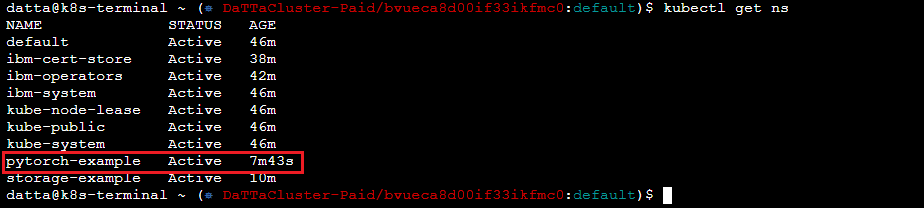
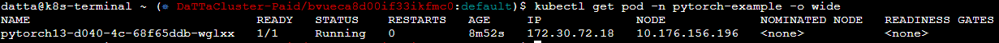
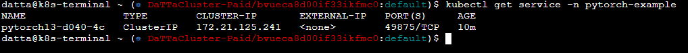
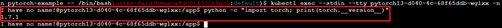

# Install PyTorch in IBM Cloud

Are you a data scientist using the IBM Cloud? Well, this documentation is for you. It will guide you on how to install PyTorch on the IBM Cloud using the Kubernetes Service. Simple and effective so you can start programming or using your PyTorch based Machine and Deep Learning models.

## Pre-requisites

You must have an account created in IBM Cloud. The account needs to be either be *Pay-As-You-Go* or *Subscription*. Click [here](https://cloud.ibm.com/docs/account?topic=account-accounts "here") to read more.
If you have a Lite account, you can upgrade it. Click [here](https://cloud.ibm.com/docs/account?topic=account-account-getting-started#account-gs-upgrade "here") to learn how to upgrade.

## Step 1: Provision Kubernetes Cluster

* Click on the search section at the top of the main page, type Kubernetes, and then choose Kubernetes Service.

* In the new window, select between the free and standard type under "Pricing plan". Once selected, click on create.

We'll choose the Standard Plan for this documentation as the Free Plan may fall short of resources when deploying your pods. We highly recommend using a Standard Plan with the hardware that suits you the best. If you're selecting the Standard Plan, please make sure you select the adequate requirements,

* Select your Kubernetes Version to be the latest available or the required one by your application. In this example, we have set it to be '1.18.13'.
* Select Infrastructure as 'Classic'.
* Leave Resource Group to 'Default'.
* Select Geography to the one that suits you better or that fits your infrastructure.
* Select Availability to be 'Single Zone' or 'Multi Zone' depending on your needs.
* Select a Worker Zone that suits you better or that fits your infrastructure.

* Select the number of workers in Worker Pool.
* Give your Worker Pool a name.
* Leave the Encrypt Local Disk option 'On'
* Choose 'Both private and public endpoints' on Master Service Endpoint

* Give your cluster a name in 'cluster-name'
* Provide the tags to your cluster and click on Create.

Wait a few minutes while your cluster is deployed.

The following checkmark and the word 'normal' will appear once the Kubernetes Cluster is deployed. You can check it under your cluster section which is located in your *Resources List*.

## Step 2:  Deploy IBM Cloud Block Storage plug-in

* Click on the search section at the top of the main page, select IBM Cloud Block Storage, and click on it.

* A new window opens, select the cluster and enter the name you want for this workspace, in this case, it will be called _storage-example_, accept the terms, click *Install* and wait a few minutes.

## Step 3: Install PyTorch

* Click on the search section at the top of the main page, type PyTorch, and click on it.

* A new window opens, select the cluster and enter the name you want for the PyTorch workspace, in this case, it will be called _pytorch-example_, accept the terms and click on *Install*. You can modify the different installation parameters at the bottom. We will leave them by default as shown below, but you can read more about setting up the parameters [here](https://cloud.ibm.com/catalog/content/pytorch "here").

## Step 4: Verify Installation

* Go to *Resources List* in the Left Navigation Menu and click on *Kubernetes*.

* Click the *Actions* button and select *Web terminal*.

* A window opens to install the web terminal, click on install and wait a few minutes. The window will pop up at the buttom If the web terminal is already installed.

* Once you have installed the terminal, open it, select web terminal, and type the following command. It will show you the workspaces of your cluster. You can see *pytorch-example* is now active.

`$ kubectl get ns`

* You can then obtain more data about the service and it's pods.

`$ kubectl get pod -n NAMESERVICE -o wide`

`$ kubectl get service -n NAME SERVICE`

* Select the pod within your service using bash.

`$ kubectl exec --stdin --tty PODNAME -n NAMESPACE -- /bin/bash`

* And finally, check if PyTorch is correctly installed checking its version:

`python -c "import torch; print(images/torch.__version__)"`

You have finished the installation, enjoy your PyTorch installation!
